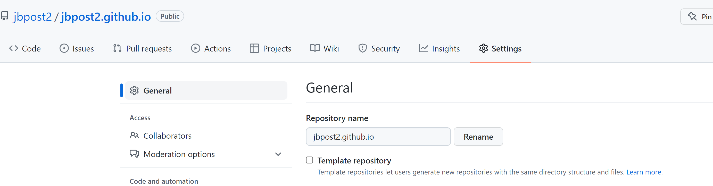

layout: true

---

```{r setup, include=FALSE,warning=FALSE,message=FALSE}
options(htmltools.dir.version = FALSE)
knitr::opts_chunk$set(
  message = FALSE,
  warning = FALSE,
  dev = "svg",
  fig.align = "center",
  #fig.width = 11,
  #fig.height = 5
  cache = FALSE
)

# define vars
om = par("mar")
lowtop = c(om[1],om[2],0.1,om[4])
library(tidyverse)
library(knitr)
library(reticulate)
options(dplyr.print_min = 5)
```


# Things That We'll Need

Github account

- Remember the process for editing files on github:

    + Make changes to files
    + Consider changes you want to keep and commit to them (sort create a new snapshot of files)
    + Push to the repo

---

# Things That We'll Need

Github account

- Remember the process for editing files on github:
    + Make changes to files
    + Consider changes you want to keep and commit to them (sort create a new snapshot of files)
    + Push to the repo
    
- Everyone has a **special** repo that can be used as a homepage

    + Use something like this (`jbpost2.github.io`) as your repository name

```{r, echo = FALSE, fig.align='center', out.width='700px'}

```


---

# Your `github.io` Page

- Automatically has **github pages** activated

- Turns `.md` files into `.html` files that are rendered for your page

    + `.md` file stand for markdown file
    
    + Many *flavors* of markdown.  Github has its own ([getting started guide](https://docs.github.com/en/get-started/writing-on-github/getting-started-with-writing-and-formatting-on-github/basic-writing-and-formatting-syntax))
    
    
---

# Your `github.io` Page

- Automatically has **github pages** activated

- Turns `.md` files into `.html` files that are rendered for your page

    + `.md` file stand for markdown file
    
    + Many *flavors* of markdown.  Github has its own ([getting started guide](https://docs.github.com/en/get-started/writing-on-github/getting-started-with-writing-and-formatting-on-github/basic-writing-and-formatting-syntax))
    
    + Can just write HTML/CSS into a `.md` file 
        - ([Example](https://raw.githubusercontent.com/jbpost2/jbpost2.github.io/main/README.md))


---

# Your `github.io` Page

- Automatically has **github pages** activated

- Turns `.md` files into `.html` files that are rendered for your page

    + `.md` file stand for markdown file
    
    + Many *flavors* of markdown.  Github has its own ([getting started guide](https://docs.github.com/en/get-started/writing-on-github/getting-started-with-writing-and-formatting-on-github/basic-writing-and-formatting-syntax))
    
    + Can just write HTML/CSS into a `.md` file 
        - ([Example](https://raw.githubusercontent.com/jbpost2/jbpost2.github.io/main/README.md))

- Lots of themes you can choose from

---

# Github Pages

- Can actually turn on github pages for any repo!

- Let's turn it on for the [OnlineProgramFunTimes repo](https://github.com/jbpost2/OnlineProgramFunTimes)

    + Add markdown, see the rendered page
    

---

# Github Pages

- Can actually turn on github pages for any repo!

- Let's turn it on for the [OnlineProgramFunTimes repo](https://github.com/jbpost2/OnlineProgramFunTimes)

    + Add markdown, see the rendered page
    
- Nice to have an offline editor for files

- RStudio works great!  (Also allows for coding/output)

    + Can output to github markdown via `output: github_document` when using R Markdown

    + Let's create an R Markdown doc and output it to see it rendered as a web page!