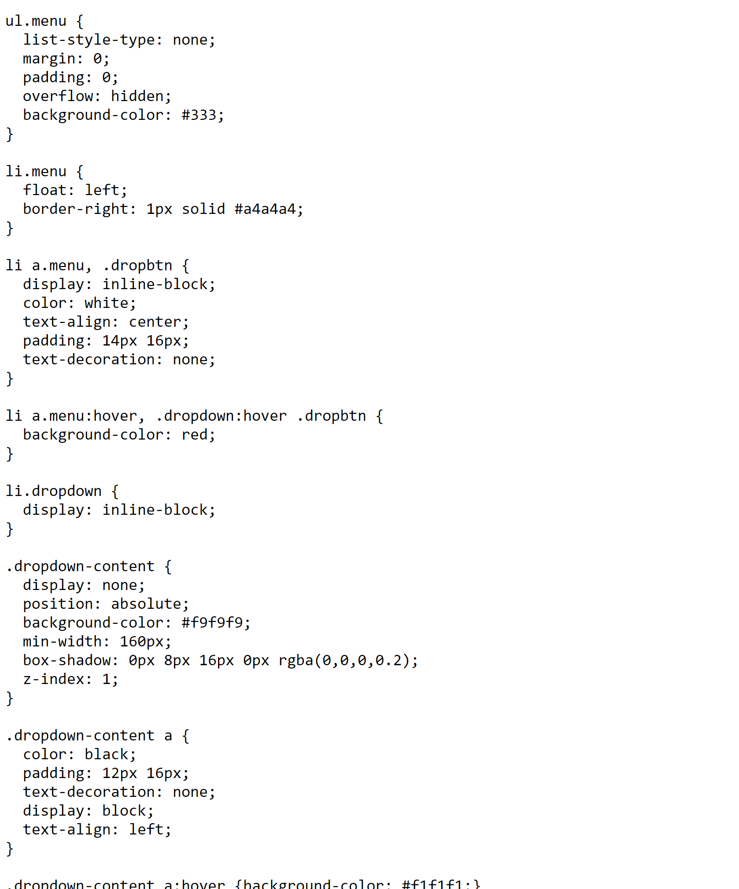
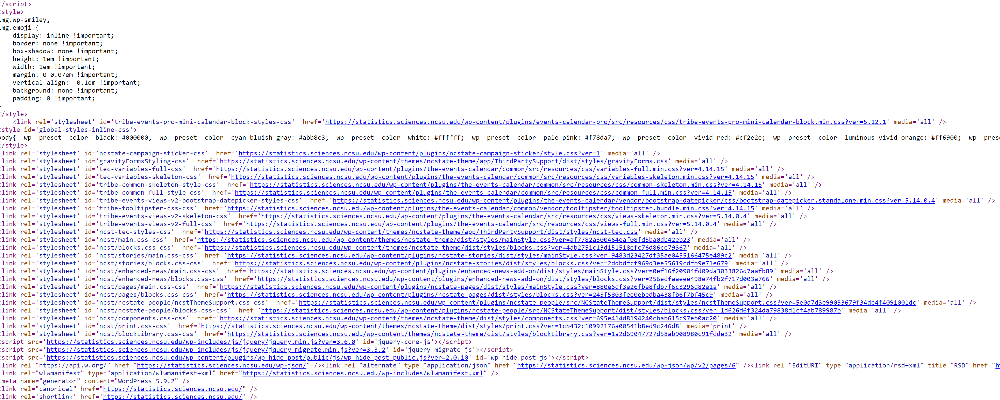

layout: true

---

```{r setup, include=FALSE,warning=FALSE,message=FALSE}
options(htmltools.dir.version = FALSE)
knitr::opts_chunk$set(
  message = FALSE,
  warning = FALSE,
  dev = "svg",
  fig.align = "center",
  #fig.width = 11,
  #fig.height = 5
  cache = FALSE
)

# define vars
om = par("mar")
lowtop = c(om[1],om[2],0.1,om[4])
library(tidyverse)
library(knitr)
library(reticulate)
options(dplyr.print_min = 5)
```


# Why Learn HTML & CSS

HTML - Hyper Text Markup Language
CSS - Cascading Style Sheets

- Allows you to create your own websites

- Easy to learn the basics

- Can combine with github markdown to easily make sites that include code & output in a reproducible manner!

```{r, echo = FALSE, fig.align='center', out.width='400px'}
knitr::include_graphics("img/github_site.png")
```


---

# Basic HTML

- Can see any sites HTML by right-clicking and "View page source"


---

# Basic HTML

- Can see any sites HTML by right-clicking and "View page source"

- Web pages have three major things:
    + A line with HTML info
    + A header section that defines things, pulls in sources, etc. (`<head>` element)
    + A body with the text for the site (`<body>` element)


---

# Basic HTML

- Can see any sites HTML by right-clicking and "View page source"

- Web pages have three major things:
    + A line with HTML info
    + A header section that defines things, pulls in sources, etc. (`<head>` element)
    + A body with the text for the site (`<body>` element)

- Body composed of HTML **tags**
    + Tags are interpreted by the browser to produce nicer looking input
    + Generally start with `<tag_name>` and end with `</tag_name>`

---

# Basic HTML

- Can see any sites HTML by right-clicking and "View page source"

- Web pages have three major things:
    + A line with HTML info
    + A header section that defines things, pulls in sources, etc. (`<head>` element)
    + A body with the text for the site (`<body>` element)

- Body composed of HTML **tags**
    + Tags are interpreted by the browser to produce nicer looking input
    + Generally start with `<tag_name>` and end with `</tag_name>`

- [Common Tags](https://www.w3schools.com/tags/ref_byfunc.asp) (let's do some examples!)
    + [w3schools.com](https://www.w3schools.com/html/default.asp) is a good way to learn the basics of HTML 


---

# What about CSS?

To customize website look, a way to style the page was needed
- Enter CSS - Cascading Style Sheets

```{r, echo = FALSE, fig.align='center', out.width='600px'}

```


---

# Basic CSS 

- Idea: Easily change the look of the site by changing elements of the style sheet (completely separate from the HTML code)

- Can do it inline (with the HTML code though)
    + [Example](https://www.w3schools.com/css/css_colors.asp)


---

# Basic CSS 

- Generally, have `.css` files you reference in the HTML doc's header
    + Define styles for different **classes** and set those in your HTML document

```{r, echo = FALSE, fig.align='center', out.width='1600px'}

```


---

# CSS & More

- Again, [w3schools](https://www.w3schools.com/css/default.asp) is a good place to get the basics of CSS

- To practice, you can make web sites on github (see next week!)

- After getting the basics down, you might learn some javascript (but that's quite a bit tougher!)

```{r, echo = FALSE, fig.align='center', out.width='500px', fig.cap="coursera"}
knitr::include_graphics("img/html_css_js.png")
```